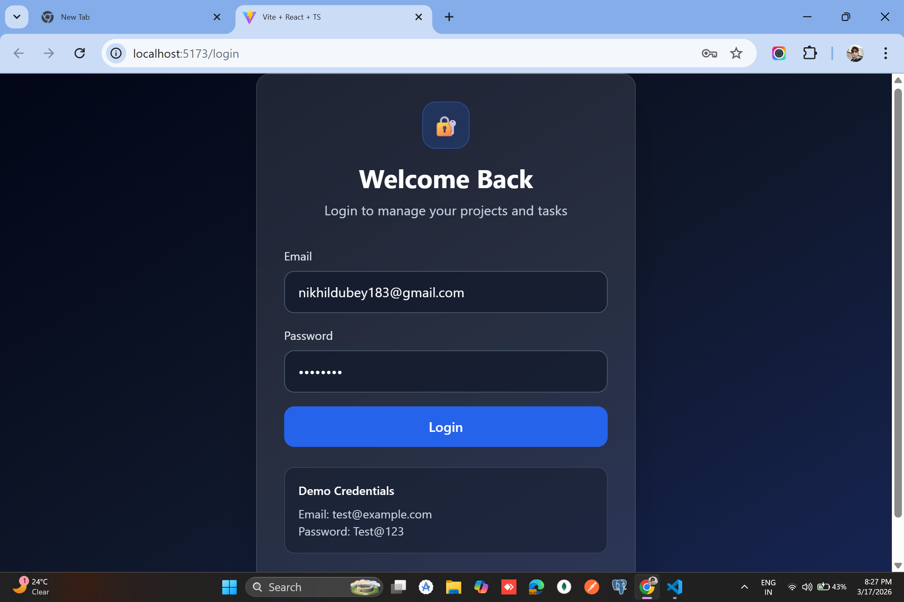
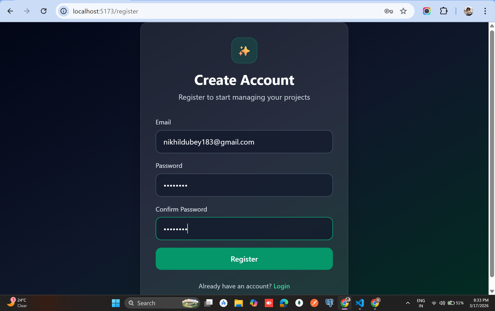
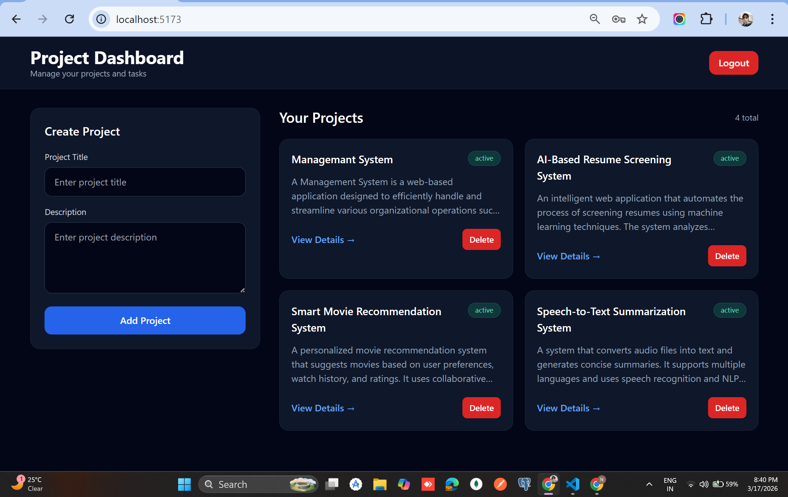
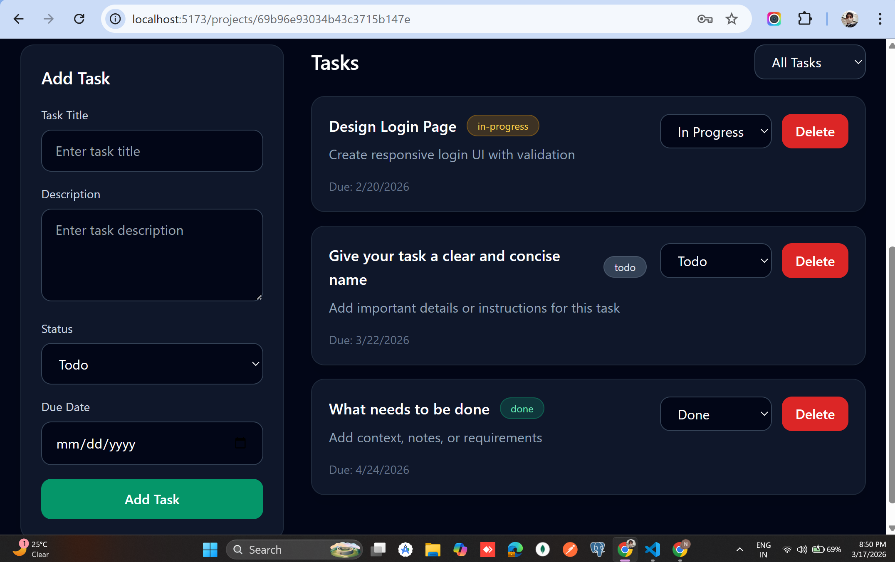
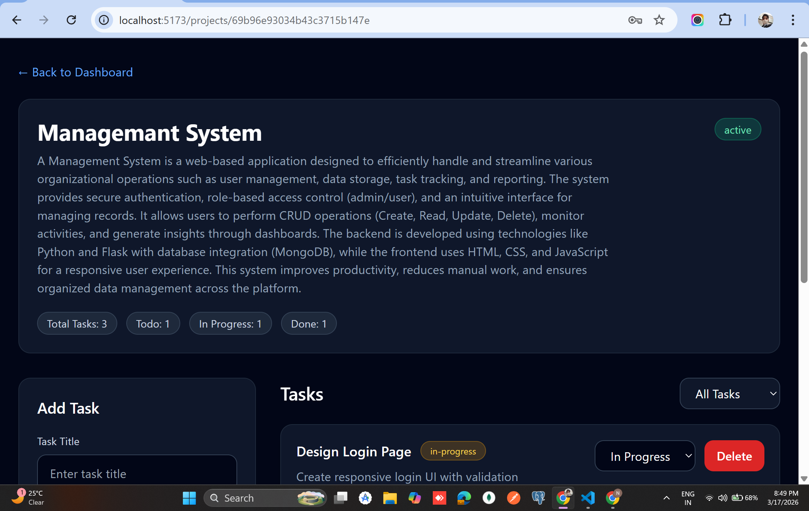

# Project Management Tool

A full-stack project management tool with JWT authentication, project CRUD, task tracking, filtering, and MongoDB seed data.

---

## Demo Credentials

Email: test@example.com  
Password: Test@123  

---

## Tech Stack

### Frontend
- React.js
- TypeScript
- Vite
- Tailwind CSS
- React Router DOM
- Axios

### Backend
- FastAPI
- PyMongo
- JWT Authentication
- Passlib + bcrypt

### Database
- MongoDB Atlas / MongoDB
  
## Database Models

User:
- email
- password (hashed)

Project:
- title
- description
- status
- user_id (ref → User)

Task:
- title
- description
- status
- due_date
- project_id (ref → Project)
---

## Important Note

The original assignment preferred Node.js for the backend. However, Python backend was explicitly approved by the recruiter, so this project uses **FastAPI** while keeping **React + TypeScript** on the frontend and **MongoDB** as the database.

---

## Features

### Authentication
- User registration
- User login
- JWT-based authentication
- Password hashing using bcrypt

### Projects
- Create project
- View own projects
- Update project
- Delete project

Project fields:
- title
- description
- status (`active`, `completed`)

### Tasks
- Create tasks under a project
- View project tasks
- Update task status
- Delete task
- Filter tasks by status

Task fields:
- title
- description
- status (`todo`, `in-progress`, `done`)
- due date

### Seed Data
- One demo user:
  - `test@example.com`
  - `Test@123`
- 2 demo projects
- 3 tasks per project

---

## Screenshots

### Login Page


### Register Page


### Dashboard


### Project List


### Project Details


---

## Project Structure

```text
project-management-tool/
├── backend/
│   ├── app/
│   │   ├── core/
│   │   ├── routes/
|   |   |-- models/
│   │   ├── schemas/
│   │   ├── services/
│   │   └── main.py
│   ├── scripts/
│   │   └── seed.py
│   ├── requirements.txt
│   └── .env.example
│
├── frontend/
│   ├── src/
│   │   ├── api/
│   │   ├── components/
│   │   ├── pages/
│   │   ├── App.tsx
│   │   └── main.tsx
│   ├── package.json
│   └── ...
│
├── screenshots/
└── README.md
